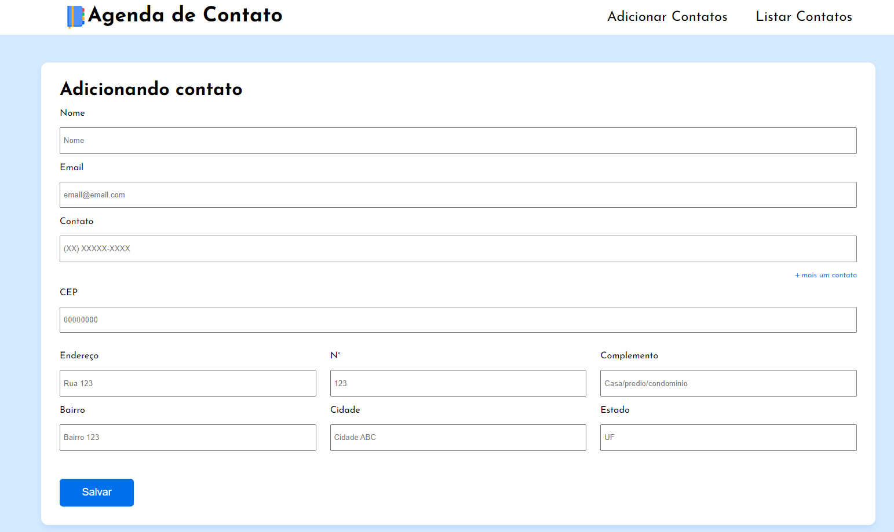

## Agenda de Contatos

- Projeto desenvolvido totalmente com HTMl, CSS e JS
- Utilizei a [ViaCEP](https://viacep.com.br/) como api de consumo de ceps
- Usei o db.json para criar a api de consumo de Contatos

### Como fazer o projeto rodar na sua máquina?

- Ao baixar rode o comando `npm i`
- Primeiro passo é fazer o db.json subir, rode o comando `npm start`
- Após isso pode usar o live server para subir o html

